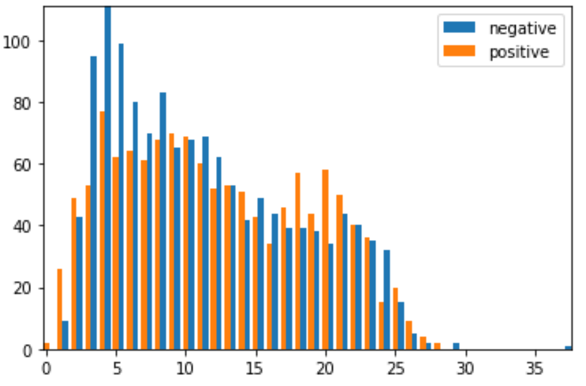

# Es Odio

## Instalación

Usar el archivo de requerimientos provisto para instalar los modulos.

```bash
pip install requirements.txt
```

Si llegase a fallar la instalacion, se puede utilizar el archivo requirements_wide ,que contiene los modulos sin indicar la version requerida.

```bash
pip install requirements_wide.txt
```

## Uso

La ejecucion del programa se puede realizar mediante python

```bash
python es_odio.py
```

y para realizar la predicción de mas tweets, se pueden incluir archivos como argumentos al programa.
Si se deseara predecir los textos en los archivos ~/textos1.csv y ../../textos2.csv,

```bash
python es_odio.py ~/textos1.csv ../../textos2.csv
```

Los resultados se escriben en un archivo con el mismo nombre que las entradas y se ubicaran en el mismo directorio.
En este caso se generarian los archivos ~/textos1.out y ../../textos2.out

## Trabajo realizado

### Análisis estadístico

Comenzamos el analisis viendo la proporcion de tweets con lenguaje de odio contra los que no lo tienen, y estas clases estan balanceadas con aproximadamente 52% contra 48%. Esto nos dice que no deberia ser necesario utilizar metodos de sampling para el aprendizaje.

Armando un ranking de las palabras que mas aparecen en cada clase, vemos que entre las 100 palabras mas comunes de cada una, solo 30 son diferentes. Esto da una idea que los tweets no son blanco y negro, dado que en muchos casos las palabras son las mismas (las cuales son en su mayoria de caracter ofensivo o segun el contexto xenofobicas). Cabe notar que estos datos estadisticos son tomados luego del preprocesamiento, por lo que las palabras removidas en esa seccion no se encuentran.

Finalmente ploteando las diferencias en los largos de las oraciones entre clases, tampoco vemos diferencias suficientes como para justificar usar el largo de las oraciones.


### Preprocesamiento

Para modularizar el preprocesamiento, se decidio definir un conjunto de funciones que se aplican en un pipe de procesamiento. De esta forma es facil de visualizar cuales se aplican y de agregar o sacar en caso de ser necesario.

Para el **parsing de texto**, se crearon funciones que remueven urls, convierten saltos de lineas a espacios (tratamos cada tweet como oracion), se remueven caracteres especiales (de puntuacion y similares), se remueven caracteres ascii y se hace un strip de espacios redundantes.

Luego se realiza la **tokenizacion** de la "oracion" resultante. Dado que se quitaron todos los caracteres que podrian haber molestado, se decidio utilizar una tokenizacion simple separando segun espacios. A pesar de esto, se intento usar el tokenizador de ntlk, pero los resultados no fueron tan buenos.

Una vez tokenizadas las oraciones, se opto por **eliminar las palabras** de dos o menos letras y las stopwords del lenguaje. Estas dos operaciones se realizan para eliminar las palabras que aparecen mucho en las oraciones y que no aportan a la decision de discurso de odio.

Finalmente se aplico **stemming y lemmatization**. En el caso de stemming se encontraron dos librerias diferentes, Porter stemming que se basa en un corpus en ingles y Snowball stemming que es especifica para el español. Sobre lematization se implemento una sola libreria.

### Metodos de aprendizaje automatico utilizados

Para el entrenamiento de los clasificadores, se consideraron dos grandes categorias, la primera con clasificadores que utilicen embeddings y la segunda con clasificadores que utilicen los valores obtenidos del metodo TF-IDF.

#### Metodos con TF-IDF

Con estos metodos simplemente se utilizo la funcion TfidfVectorizer de sklearn, entrenando y realizando el fitting con los datos de entrenmiento y test.

Para el enrenamiento, se probo con cuatros modelos diferentes: **Regresion logistica** (sklearn), **Random Forest** (sklearn), **Clasificador XBG** (XGBoost) y **Clasificador LGBMC** (lightbgm).
La combinacion entre malos resultados obtenidos y la poca familiaridad con los modelos (en el caso de los ultimos dos), llevo a que se descartara esta linea.

#### Metodos con Embeddings

Para el embedding se implementaron tres metodos diferentes pero todos utilizando fasttext para su realizacion. El primero consiste en cargar los embeddings que fueron entregados para realizar la tarea, el segundo en entrenar un modelo de embeddings en base al corpus de entrenamiento y finalmente importar el modelo preentrenado para el español por fasttext.

Debido a que el modelo entrenado con el corpus de entrenamiento no tenia suficientes cantidades de texto, la calidad de los embeddings no era suficiente para dar buenos resultados. Y en el caso del embedding importado de fasttext, debido al peso del mismo, el tiempo que agregaba a las ejecuciones hacia imposible que se ejecutara dentro del plazo exigido.

Es por esto que se termino utilizando el embedding implementado originalmente, a pesar de que los mejores resultados se obtuvieron con la tercer implementacion. La lematizacion y stemming tuvieron que ser removidas para evitar agregar todavia mas palabras que no eran reconocidas al embedding, consa que no pasaba con los otros embeddings.

Para el enternamiento se utilizaron dos modelos, el primero mediante svm y el segundo utilizando LSTM+MLP.
El **modelo LSTM** fue basado en el articulo [Detecting and Monitoring Hate Speech in Twitter](https://www.ncbi.nlm.nih.gov/pmc/articles/PMC6864473/pdf/sensors-19-04654.pdf), del cual se tomo la arquitectura utilizada. Esta consista en una capa de LSTM de dimension 300 (dimension de los embeddings) cuyo resultado pasa a una MLP de dos capas ocultas con tamaños 600 (entrada), 1600, 100 y 1 (salida). Cada capa teniendo un dropout asocidado y funciones de activacion Relu (Excepto LSTM que usaba Tanh y la capa de salida que suaba Sigmoid para facilitar la salida binaria.)

Este modelado fue realizado con las librerias de keras y el entrenamiento se realizo mediante google collab utilizando un rintime que contaba con una gpu. Debido a la cantidad de pesos que se debian entrenar, no usar gpu llevaba que el tiempo superara el exigido, por lo que debio descartarse esta linea.

El **modelo SVM** fue el implementado por sklearn y debido a la rapidez del entrenamiento ya sea con gpu o cpu y a los buenos resultados, se decidio por utilizar este modelo para el programa.

Una vez decidido el modelo, se utilizo la funcion de RandomizedSearchCV, que permite hacer una busqueda aleatoria en un espacio de hyperparametros usando cross validation. Los parametros utilizados para esta busqueda fueron los kernels "rbf", "poly" y "sigmoid", c (regularizacion) de 1e^-2 a 1e^10 (saltos de factor 10) y gamma de 1e^-9 a 1e^3 (saltos de factor 10). Esto genera una grilla de 507 elementos de los cuales buscamos 100 (de forma aleatoria). [Inspiracion](https://scikit-learn.org/stable/auto_examples/svm/plot_rbf_parameters.html).

## Posibles mejoras

Para mejorar el resultado del programa, se podrian haber realizado dos tareas claves, que permiten utilizar LSTM en el tiempo acotado. La primera consiste en utilizar algun metodo de transfer learning o preentrenamiento para evitar requerir una gran cantidad de epochs y poder hacer un entrenamiento mas rapido. La segunda clave seria utilizar pytorch, que permite trabajar a un nivel mas bajo que keras y de esta forma generar algunas optimizaciones que podrian haber ahorrado tiempo.

Respecto a la cantidad de datos, se podrian haber obtenido mas tweets de tweeter y utilizar bootstrap o algun modelo existente preentrenado para conseguir mas datos.
